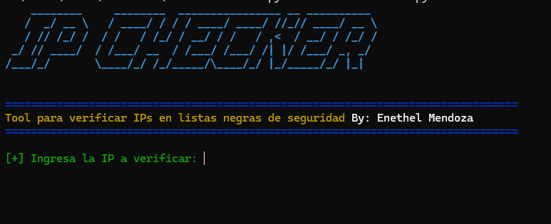

```markdown
<p align="center">
  
</p>
# 🛡️ CheckListsBlack

**CheckListsBlack** es una herramienta de línea de comandos desarrollada en Python para verificar si una dirección IP está listada en múltiples listas negras (blacklists) de seguridad reconocidas, como Spamhaus, SORBS, Barracuda, entre otras.

---

## 🚀 Características

- Consulta la reputación de una IP en varias listas negras DNSBL.
- Presenta un banner visual en la consola usando arte ASCII.
- Resultados codificados por colores para una interpretación rápida:
  - 🟢 *No listada*
  - 🔴 *LISTADA*
- Fácil de usar, ideal para tareas de análisis forense, pentesting o administración de redes.

---

## 🧰 Requisitos

Antes de ejecutar la herramienta, asegúrate de instalar las dependencias. Ya se incluye un archivo `requirements.txt`, por lo que puedes instalar todo con:

```bash
pip install -r requirements.txt
```

---

## 📦 Dependencias utilizadas

- `dnspython`: Para realizar consultas DNS a las listas negras.
- `pyfiglet`: Para generar un banner visual atractivo en la consola.
- `termcolor`: Para dar color a los textos en la terminal.
- *(Otros paquetes como `requests`, `folium`, `ipwhois`, `matplotlib` están listos para futuras ampliaciones.)*

---

## 🖥️ Uso

1. Ejecuta el script:

```bash
python3 CheckListsBlack.py
```

2. Ingresa la dirección IP cuando se te solicite.

3. Observa los resultados de la verificación.

---

## 📌 Ejemplo de salida

```
[+] Ingresa la IP a verificar: 8.8.8.8

[+] Consultando listas negras...

Resultados:
Spamhaus (ZEN)       : No listada
SORBS                : LISTADA ['127.0.0.2']
Barracuda            : No listada
SpamCop              : No listada
UCEPROTECT           : LISTADA ['127.0.0.3']

[*] Consulta completada.
```

---

## 👤 Autor

**Enethel Mendoza**  
Proyecto educativo y de análisis de reputación de IPs.
```
